.. _chapter:6:

Graficador
==========

El graficador de *NovaLabUD* está diseñado para visualizar los datos subidos al software y previamente tratados siguiendo las secciones anteriores. Esta sección guiará al usuario en el uso de las funciones principales del graficador, desde la personalización de los datos hasta la exportación de los gráficos. Esta funcionalidad tiene como fin permitir que el usuario personalice a gusto las gráficas obtenidas y que estas puedan ser usadas en: informes de laboratorio, presentaciones, entre otras. Para acceder a esta funcionalidad seleccionar el botón *Ver* en el menú de la pantalla principal.

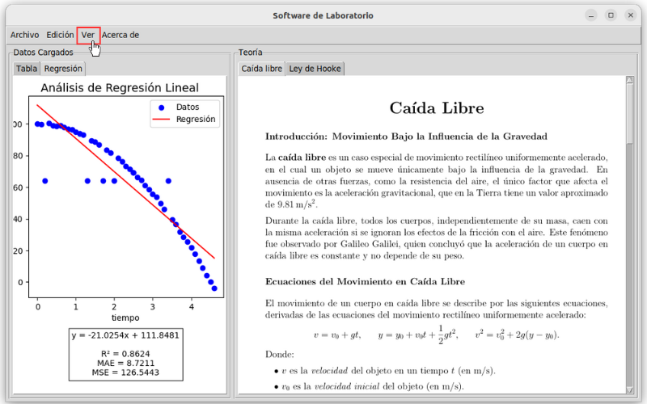

   Selección del botón *Ver* para abrir el graficador.

Interfaz
--------

Al abrir el graficador, se observa que, además de tener la sección principal, cuenta con un menú que permitirá el manejo de archivos, personalización de la gráfica, entre otros. Este menú permitirá seleccionar alguna de sus funcionalidades: gráfica de regresiones, personalización de las gráficas, exportación del gráfico generado, limpieza y una sección de ayuda que permitirá al usuario ingresar a esta sección del manual en caso de ser necesario.

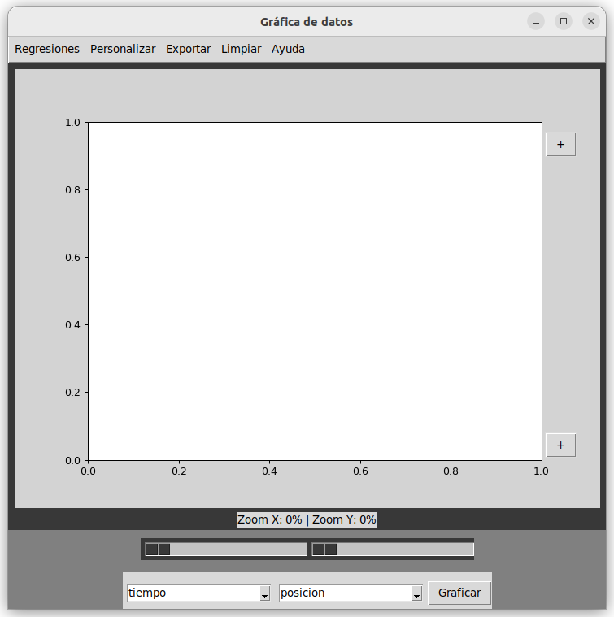

   Interfaz principal del graficador.

Selección de columnas y visualización de la gráfica
---------------------------------------------------

Por medio del manejo de archivos temporales se garantiza el uso de los datos a los cuales el usuario haya realizado las últimas modificaciones o transformaciones explicadas en capítulos anteriores. Se visualizan dos menús desplegables que permitirán seleccionar de un listado el par de columnas que se desea graficar, según los encabezados del archivo. Una vez elegidas las columnas deseadas, seleccionar el botón *Graficar* para generar el gráfico.

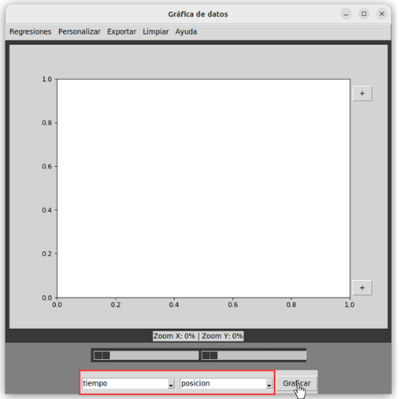

   Selección de columnas.

De este modo, se pueden visualizar los datos representados gráficamente.

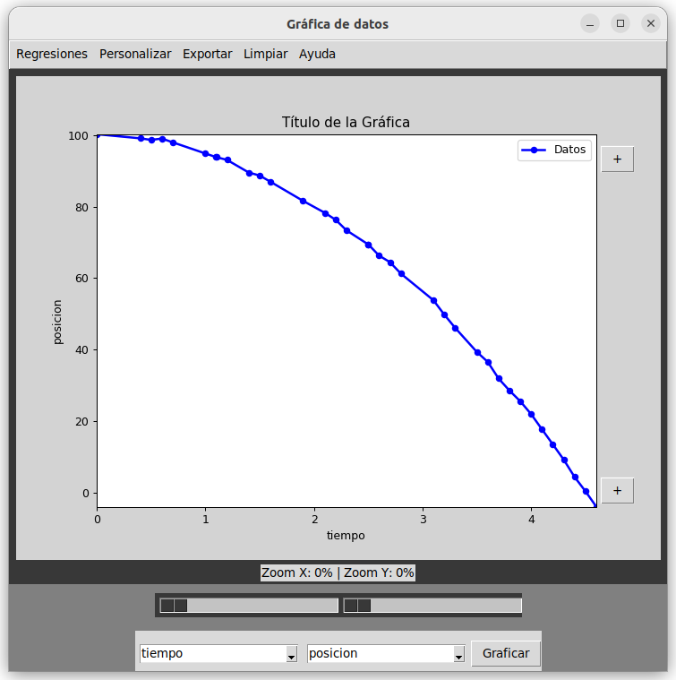

   Visualización de los datos graficados.

Selección de límites y tamaño
-----------------------------

La herramienta de zoom permite acercar o alejar la visualización del gráfico para analizar detalles específicos. Como se muestra en la Figura :ref:`fig:zoom`, el zoom se manipula utilizando barras deslizantes ubicadas en la parte inferior de la ventana. Estas barras permiten ajustar el nivel de acercamiento tanto del eje X como del eje Y de manera intuitiva. En la parte superior de este par de barras se puede visualizar una etiqueta de porcentajes indicando la amplitud del zoom:

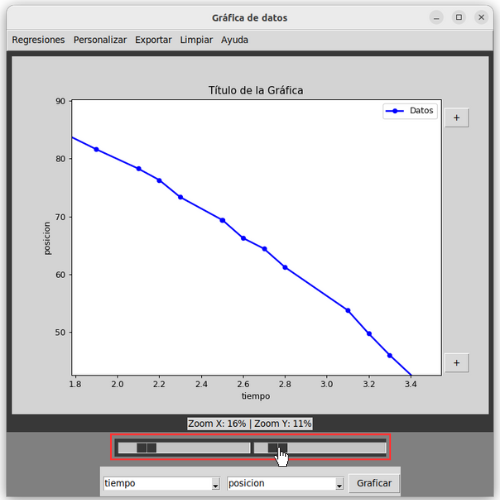

   Manipulación de zoom.

Por otro lado, es posible personalizar los rangos de los ejes X y Y mediante la configuración de valores mínimos y máximos, estos son ajustables presionando el botón de [+] ubicado en la parte inferior derecha de la interfaz para modificar el rango del eje X y presionando el botón de [+] ubicado en la parte superior derecha para modificar el rango del eje Y.

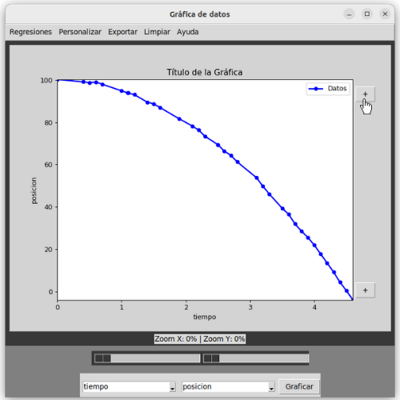

   Selección de límites eje Y.

Al presionar cualquiera de estos botones, se abrirá una ventana emergente con campos de texto donde podrás ingresar los valores mínimos y máximos de manera numérica. A continuación se muestra el ejemplo para el caso de los límites del eje y.

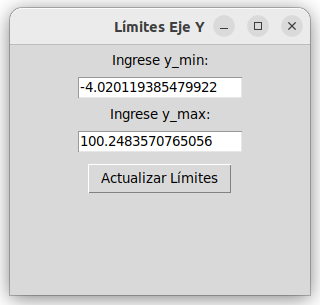

   Selección de límites para el eje Y.

Para ambos casos la ventana emergente solicita que el usuario ingrese manualmente los nuevos límites de la gráfica. En dado caso que el valor ingresado no sea numérico o el valor del límite mínimo sea mayor al máximo y viceversa se mostrará un mensaje de error.

Edición de título y ejes
------------------------

El graficador ofrece opciones de personalización que permiten modificar los títulos de los ejes y el título del gráfico para adaptarlos según las necesidades del usuario. Para esto se debe hacer doble click sobre el título que se desea modificar y aparecerá una ventana emergente como la mostrada en la Figura :ref:`fig:personaltitulo`. En esta ventana, se puede escribir un nuevo título en el campo de texto, seleccionar el tamaño del texto utilizando un menú desplegable, y elegir una fuente entre las opciones disponibles para personalizar el estilo del título. Una vez configurados todos los parámetros, basta con hacer clic en el botón *Aplicar* para que los cambios se reflejen directamente en el gráfico.

*Si se desea quitar alguno de los títulos, se debe dejar el campo de texto vacío.*

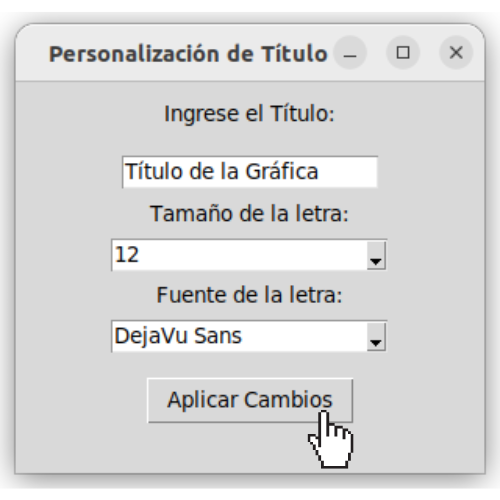

   Edición del título de la gráfica.

Graficación de regresiones
--------------------------

Ya que el graficador tiene como fin principal ofrecer al usuario una herramienta de personalización de gráficas, previamente en la ventana principal de la aplicación el usuario ya pudo identificar que modelo ajusta mejor el conjunto de datos. En esta sección simplemente basta con seleccionar el botón de *Regresiones* en la barra de menú y seleccionar del menú desplegable el modelo deseado.

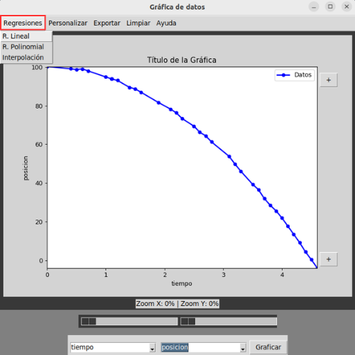

   Selección de *Regresión* para graficar el modelo de ajuste junto con los datos.

Luego de ello se debe seleccionar el botón *Graficar* y el ajuste se graficará con los datos como se muestra en la siguiente imagen. También se puede visualizar una pequeña etiqueta en la parte superior derecha de la gráfica para distinguir entre los datos generados por el modelo y el conjunto de datos previamente tratados.

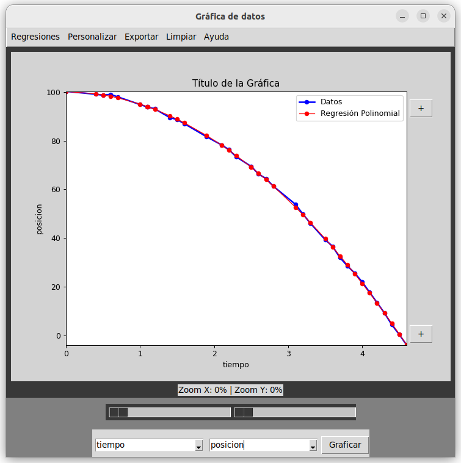

   Selección de *Regresión* para graficar junto con los datos.

Edición de puntos
-----------------

Las funcionalidades principales para editar los puntos de la gráfica están disponibles en una ventana de configuración que aparece al seleccionar el botón *Personalizar*.

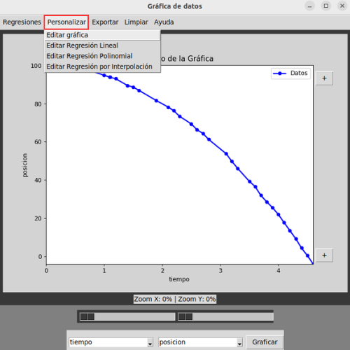

   Personalización de datos y regresión.

De esa manera se despliega un menú el cual permite escoger entre la personalización de los datos y la personalización de la regresión seleccionada. En el caso de seleccionar *Editar gráfica* se abre una ventana emergente que ofrece diversas opciones, tales como activar la grilla, seleccionar un marcador diferente para los puntos, y ajustar los tamaños tanto de las líneas como de los puntos. Estos cambios se visualizan de manera automática en el gráfico.

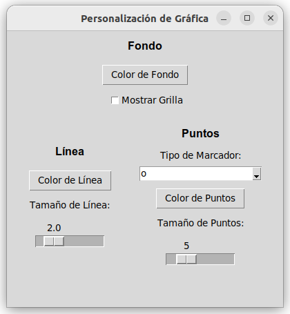

   Vista general edición de puntos para los datos.

En el caso de querer editar el gráfico generado por alguna de las regresiones, el software permitirá realizar las mismas ediciones exceptuando el color de fondo y la activación de la grilla.

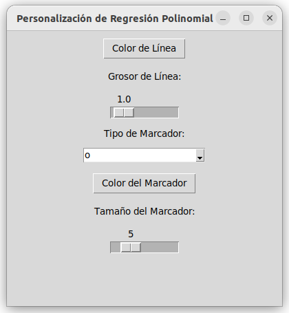

   Vista general edición de puntos para los métodos.

Además, el color de los puntos, línea o fondo puede ajustarse gracias a un selector de colores que permite elegir entre una amplia variedad de tonalidades.

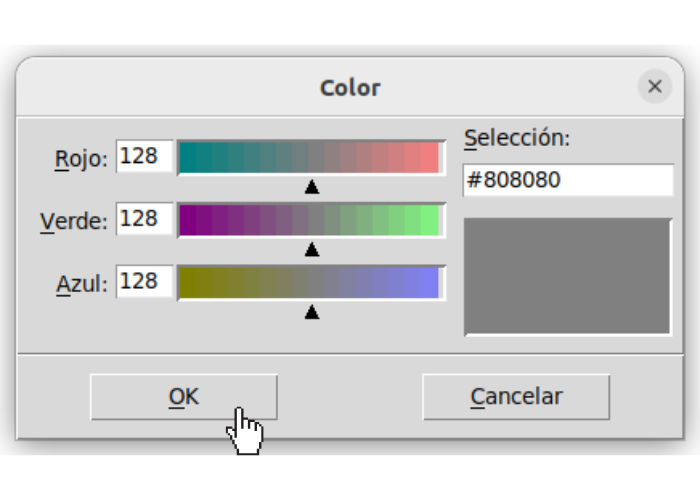

   Selector de colores para la personalización de los datos.

Cabe aclarar que la aplicación solo permite editar los puntos de la regresión siempre y cuando esta ya se encuentre graficada haciendo uso del botón *Regresiones*. En el caso en que el usuario pretenda editar una función la cual no se encuentra en la gráfica aparecerá un mensaje de error solicitando que primero se grafique el modelo de ajuste antes de editar.

Guardar gráfica
---------------

También es posible guardar la gráfica personalizada en diferentes formatos de imagen. Al seleccionar la opción *Exportar* en el menú se puede seleccionar alguno de los formatos de exportación.

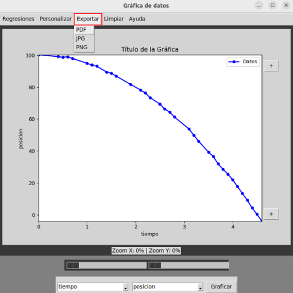

   Exportación de la gráfica en diferentes formatos.

Se despliega una ventana donde el usuario puede elegir el formato deseado entre PNG, JPG o PDF y especificar la ubicación y el nombre del archivo. Esto facilita la integración del gráfico generado personalizado en los informes de laboratorio o presentaciones dependiendo de las necesidades del usuario.

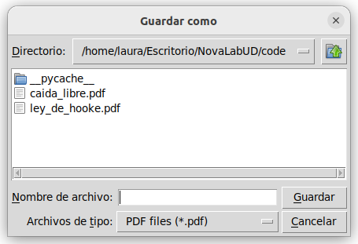

   Guardar gráfica en formato PDF.

Limpiar gráfica
---------------

En el caso en que el usuario desee deshacer todas las ediciones del gráfico, incluyendo los títulos, se selecciona el botón *Limpiar*, que se encuentra al final del menú. Por cuestiones de seguridad, antes de limpiar la gráfica el software genera un mensaje de advertencia, el cual indica que después de limpiar el gráfico las ediciones realizadas no se guardarán.

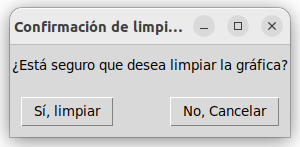

   Limpiar ediciones de la gráfica.

Recomendaciones de uso
----------------------

Antes de comenzar:

1. Tener conocimiento sobre cuál modelo se ajusta mejor a los datos.
2. El par de columnas que se deseen graficar deben ser numéricas.

Durante la edición:

1. Al graficar el modelo de ajuste, después de seleccionado, es necesario hacer clic sobre el botón *Graficador* para actualizar la gráfica.
2. Para personalizar los puntos de la gráfica del modelo es necesario que este ya se encuentre previamente graficado.

Al finalizar:

1. Se recomienda exportar la imagen en alguno de los formatos ofrecidos por la aplicación. En el caso de seleccionar *Limpiar* o al cerrar la ventana del graficador aparecerá un mensaje confirmando la acción, en el caso de seleccionar de manera positiva al mensaje los últimos cambios realizados no se guardarán. Esto debido a que NovaLabUD no maneja un control de versiones.